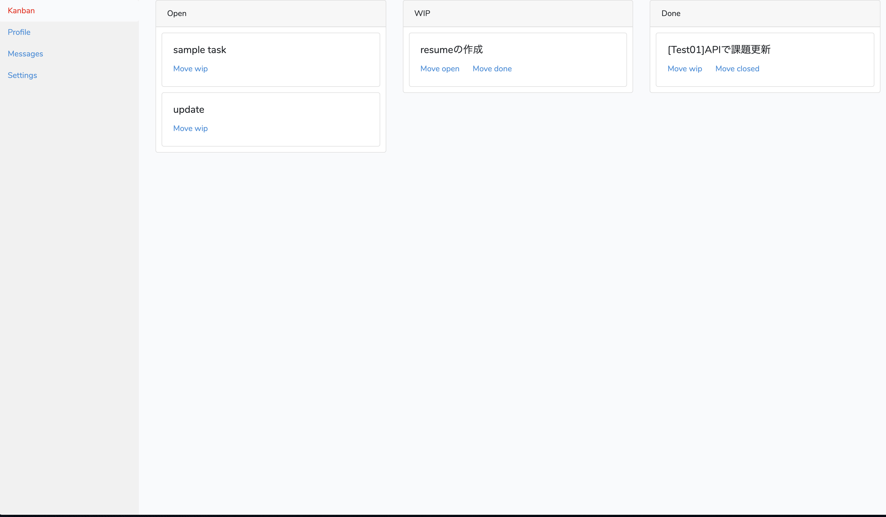

# Dashboard



## Getting started

githubからプロジェクトをクローンしてくる

```
$ git clone git@github.com:kiyo27/laravel-dashboard.git
```

laravelの``.env``を作成する

```
$ cd laravel-dashboard/project/dashboard
$ cp .env.example .env
```

dockerコンテナを立ち上げる

```
$ cd ../..
$ docker-compose up -d
```

ダッシュボード画面にアクセスする. ``localhost/dashboard``